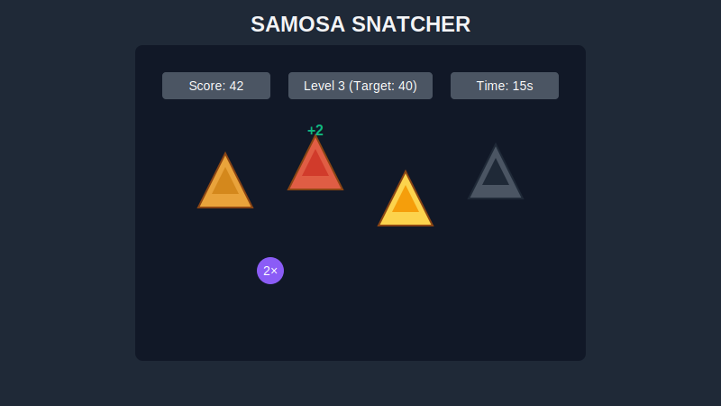

# 🥟 Samosa Snatcher

A fast-paced, reaction-based web game where you slice samosas for points while avoiding burned ones.



## 🎮 Play Now

[Play Samosa Snatcher online](https://samosa-snatcher.vercel.app)

## 🔍 Game Overview

Samosa Snatcher is a fun, addictive game inspired by Fruit Ninja. Players must quickly click (or tap) samosas as they appear on screen to earn points, while avoiding burned samosas that penalize your score. The game features different types of samosas with varying point values, power-ups that enhance gameplay, and a progressive difficulty system.

## ✨ Features

- **Multiple Samosa Types:**
  - Regular Samosa (1 point)
  - Spicy Samosa (2 points)
  - Golden Samosa (5 points)
  - Burned Samosa (-10 points penalty)

- **Power-ups:**
  - ⏱️ Time Bonus: Adds 10 seconds to your timer
  - 2️⃣ Score Multiplier: Doubles your points for 8 seconds
  - 💥 Bomb: Instant game over (high risk, avoid!)

- **Progressive Difficulty:**
  - Game speed increases with each level
  - More burned samosas appear at higher levels
  - Greater challenge as you advance

- **Visual Feedback:**
  - Score popups show points earned
  - Animated effects for special events
  - Visual indicators for power-ups

- **Responsive Design:**
  - Works on both desktop and mobile devices
  - Touch-friendly controls for mobile play

## 🎯 How to Play

1. Click the "START GAME" button
2. Click/tap samosas as they appear on screen to earn points
3. Avoid burned samosas which cost you 10 points
4. Collect power-ups to gain advantages
5. Reach the target score to advance to the next level
6. Game ends when the timer reaches zero

## 🛠️ Tech Stack

- **Frontend Framework:** React
- **Styling:** Tailwind CSS
- **Animation:** Custom CSS animations
- **Build Tool:** Vite
- **Deployment:** Vercel
- **Game Engine:** Custom JavaScript game loop
- **State Management:** React useState/useEffect
- **Assets:** SVG graphics for optimized performance

## 🚀 Getting Started

### Prerequisites
- Node.js (v14 or later)
- npm or yarn

### Installation

1. Clone the repository:
```bash
git clone https://github.com/yourusername/samosa-snatcher.git
cd samosa-snatcher
```

2. Install dependencies:
```bash
npm install
# or
yarn install
```

3. Start the development server:
```bash
npm run dev
# or
yarn dev
```

4. Open your browser and navigate to `http://localhost:5173`

## 🏗️ Building for Production

```bash
npm run build
# or
yarn build
```

## 🧪 Future Enhancements

- Leaderboard system
- Additional power-ups and samosa types
- Sound effects and background music
- More challenging game modes
- Achievement system

## 📝 License

MIT License

## 🙏 Acknowledgements

- Inspired by Fruit Ninja
- Developed with ❤️ by [Your Name]
